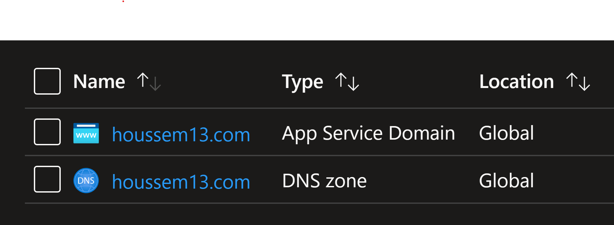
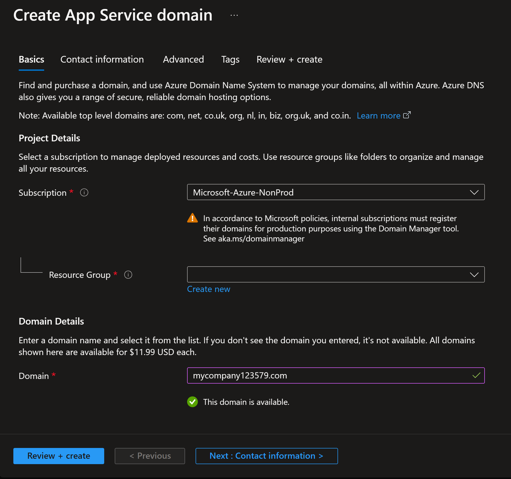

# Azure App Service Domain in Terraform

## News

This is now available as Terraform module on Terraform Registry: https://registry.terraform.io/modules/HoussemDellai/appservice-domain/azapi/

## Problem

You can create a custom domain name in Azure using App Service Domain service.
You can do that using Azure portal or Azure CLI.
But you cannot do that using Terraform for Azure provider.
Because that is not implemented yet.
Creating a custom domain in infra as code tool like Terraform might not be that much appealing for enterprises.
They would purchase their domain name manually, just once. Infra as code doesn't make lots of sense here.

However for labs, workshops and demonstrations, this is very useful to make the lab more realistic.

## Solution

We'll provide a Terraform implementation for creating a custom domain name using Azure App Service Domain.
We'll use `AzApi` provider to create the resource. More info about AzApi here: https://registry.terraform.io/providers/Azure/azapi/latest/docs/resources/azapi_resource.

The AzApi will call the REST API and pass the required JSON file containing the needed attributes.
Take a look at the REST API for App Service Domain here: https://learn.microsoft.com/en-us/rest/api/appservice/domains/create-or-update

We also create an Azure DNS Zone to manage and configure the domain name.

And we create an A record "test" to make sure the configuration works.

The complete Terraform implementation is in this current folder.
But here is how to use it.

```terraform
resource "azurerm_dns_zone" "dns_zone" {
  name                = var.domain_name
  resource_group_name = azurerm_resource_group.rg.name
}

resource "azapi_resource" "appservice_domain" {
  type                      = "Microsoft.DomainRegistration/domains@2022-09-01"
  name                      = var.domain_name
  parent_id                 = azurerm_resource_group.rg.id
  location                  = "global"
  schema_validation_enabled = true

  body = jsonencode({

    properties = {
      autoRenew = false
      dnsType   = "AzureDns"
      dnsZoneId = azurerm_dns_zone.dns_zone.id
      privacy   = false

      consent = {
        agreementKeys = ["DNRA"]
        agreedBy      = var.AgreedBy_IP_v6 # "2a04:cec0:11d9:24c8:8898:3820:8631:d83"
        agreedAt      = var.AgreedAt_DateTime # "2023-08-10T11:50:59.264Z"
      }
    <removed for brievity>
```

## Deploy the resources using Terraform

Choose the custom domain name you want to purchase in the file `terraform.tfvars`.

Then run the following Terraform commands from within the current folder.

```powershell
terraform init
terraform plan -out tfplan
terraform apply tfplan
```

## Test the deployment

Verify you have two resources created within the resource group.



Verify that custom domain name works.
You should see the IP address we used in A record which is `1.2.3.4`.

```powershell
nslookup test.<var.domain_name> # replace with domain name
# Server:  bbox.lan
# Address:  2001:861:5e62:69c0:861e:a3ff:fea2:796c
# Non-authoritative answer:
# Name:    test.houssem13.com
# Address:  1.2.3.4
```

## Creating a custom domain name using Azure CLI

In this lab we used Terraform to create the domain name.
But still you can just use Azure portal or command line.



Make sure you fill the `contact_info.json` file. It is required to create domain name.

```powershell
az group create -n rg-dns-domain -l westeurope -o table

az appservice domain create `
   --resource-group rg-dns-domain `
   --hostname "houssem.com" `
   --contact-info=@'contact_info.json' `
   --accept-terms
```

## Video tutorial

Here is a Youtube video explaining how this works: [https://www.youtube.com/watch?v=ptdAcsG2ROI](https://www.youtube.com/watch?v=ptdAcsG2ROI)


## Important notes

You should use a Pay-As-You-Go azure subscription to be able to create Azure App Service Domain.
MSDN/VisualStudio and Free Azure subscriptions doesn't work.

Within the terraform config file, you can change the contact info for the contactAdmin, contactRegistrant, contactBilling and contactTech.
It worked for me when reusing the same contact !

## What is next ?

You can explore App Service Domain with Azure Container Apps (ACA) in this lab: https://github.com/HoussemDellai/aca-course/tree/main/14_aca_custom_domain.