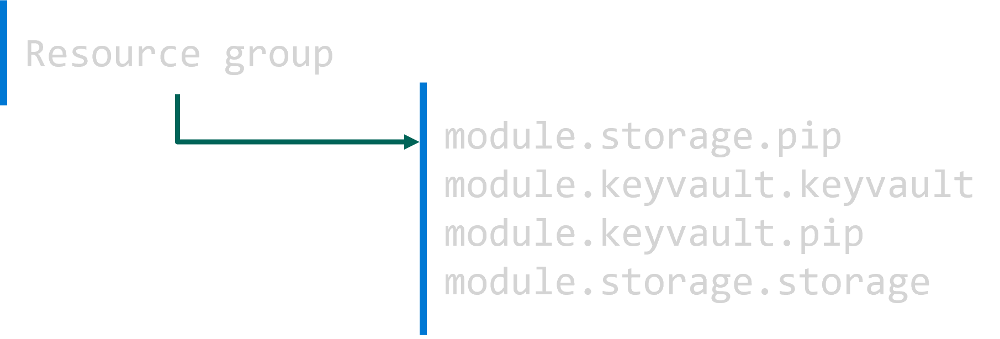
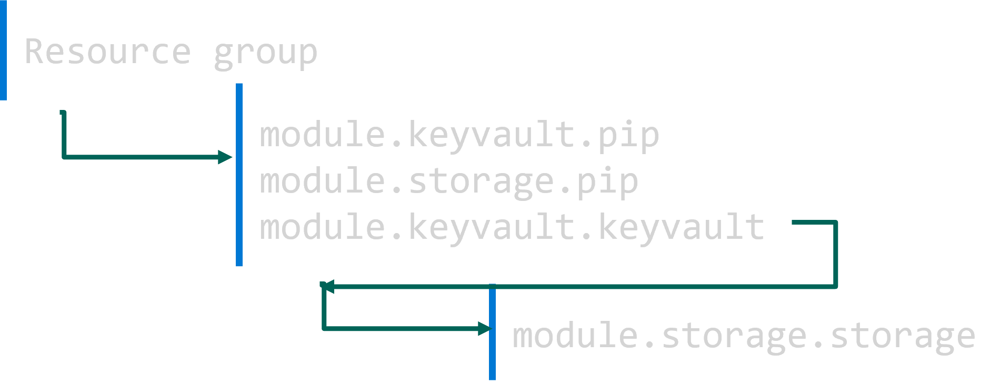

# Learn by doing: Terraform modules dependencies

## Introduction

In this lab, you will deep dive into learning Terraform modules dependencies.
Through examples, you will learn how Terraform manages the chaining of resource creation regarding dependencies.
This will allow you to better understand Terraform behaviour and optimize resource creation time.

You will work with two sample modules provided under the `\modules` folder: keyvault and storage_account.
Keyvaul module creates an Azure Key vault and a Public IP resources.
Storage_account creates an Azure Storage Account and a Public IP resources.
The Public IP resource has nothing to do with the storage account or key vault.
It is needed just for demoing purposes.

Both modules depends implicitly on the resource group created at the root resource as they reference the resource group name and location.

## Scenario 1: no dependencies between modules

In this scenarion, module storage account does not depend on module keyvault.
There are no explicit or implicit dependency.

In the following example, the module doesn't depend on any other module.
It just depends on a resource group at the root configuration.

```hcl
resource "azurerm_resource_group" "rg" {
  name     = "rg-prod"
  location = "westeurope"
}

module "keyvault" {
  source = "./modules/keyvault"

  key_vault_name      = "kv123579"
  resource_group_name = azurerm_resource_group.rg.name
}

module "storage_account" {
  source = "./modules/storage_account"

  storage_account_name = "strg1235790"
  resource_group_name  = azurerm_resource_group.rg.name
}
```

Let's run two independant modules and see what will happen.
Make sure that only resource group, key vault and storage account are uncommented.

```terraform
terraform init
terraform apply -auto-approve

# azurerm_resource_group.rg: Creating...
# azurerm_resource_group.rg: Creation complete after 2s
# module.storage_account.azurerm_public_ip.pip: Creating...
# module.keyvault.azurerm_key_vault.keyvault: Creating...
# module.keyvault.azurerm_public_ip.pip: Creating...
# module.storage_account.azurerm_storage_account.storage: Creating...
# module.keyvault.azurerm_public_ip.pip: Creation complete after 2s
# module.storage_account.azurerm_public_ip.pip: Creation complete after 2s
# module.storage_account.azurerm_storage_account.storage: Creation complete after 22s
# module.keyvault.azurerm_key_vault.keyvault: Creation complete after 2m9s
```

Note from the output, because there is no dependencies between modules, the resources will be created in parallel.



> Resources from independant modules will be created in parallel, with no specified order.

Cleanup the resources before continuing with the next scenario.

```terraform
terraform destroy -auto-approve
```

## Scenario 2: module depends explicitly on another module

In this scenario, you explore a Terraform keyword called `depends_on`.
This was introduced first to set dependencies between resources.
Starting from version 0.13 of terraform, `depends_on` could be used also for setting dependencies between modules.

Let's see how that works.
You will have two modules where the second module depends on the first one.

The syntax in Terraform is the following.

```hcl
module "storage_account" {
  source               = "./modules/storage_account"
  storage_account_name = "strg1235790"
  resource_group_name  = azurerm_resource_group.rg.name
  depends_on           = [ module.keyvault ] # explicit dependency on entire module
}
```

To test this scanario, make sure that only resource group, key vault and storage account (scenatrio 2) are uncommented.
Then run the terraform apply command to create the resources.

```terraform
terraform apply -auto-approve

# azurerm_resource_group.rg: Creating...
# azurerm_resource_group.rg: Creation complete after 1s
# module.keyvault.azurerm_public_ip.pip: Creating...
# module.keyvault.azurerm_key_vault.keyvault: Creating...
# module.keyvault.azurerm_public_ip.pip: Creation complete after 2s
# module.keyvault.azurerm_key_vault.keyvault: Creation complete after 2m40s
# module.storage_account.azurerm_public_ip.pip: Creating...
# module.storage_account.azurerm_storage_account.storage: Creating...
# module.storage_account.azurerm_public_ip.pip: Creation complete after 3s
# module.storage_account.azurerm_storage_account.storage: Creation complete after 27s
```

Note how the resources from the storage account module are created after all the resources from the kayvault module.


>The impact of explicit dependency between modules is that the resources from the dependant module will be delayed until the creation of all resources from original module.

## Scenario 3: module depends implicitly only on a specific resource from another module

In this scenario, you will explore an implicit dependency on a specific resource within a module.
An impilict dependency is a direct reference to a resource or data property like the name, location, tags, etc.
Let's run an experiment to see the impact.

```hcl
module "storage_account" {
  source               = "./modules/storage_account"
  storage_account_name = module.keyvault.key_vault_name # implicit dependency on resource from another module
  resource_group_name  = azurerm_resource_group.rg.name
}
```

Run Terraform command to create the resources.

```terraform
terraform apply -auto-approve

# azurerm_resource_group.rg: Creating...
# azurerm_resource_group.rg: Creation complete after 0s
# module.keyvault.azurerm_public_ip.pip: Creating...
# module.storage_account.azurerm_public_ip.pip: Creating...
# module.keyvault.azurerm_key_vault.keyvault: Creating...
# module.keyvault.azurerm_public_ip.pip: Creation complete after 3s
# module.storage_account.azurerm_public_ip.pip: Creation complete after 3s
# module.keyvault.azurerm_key_vault.keyvault: Creation complete after 2m12s
# module.storage_account.azurerm_storage_account.storage: Creating...
# module.storage_account.azurerm_storage_account.storage: Creation complete after 25s
```

Note frm the results of this experiment that creation of the dependant resource, which is the the storage account, started only after the creation of the key vault, as it depends implicitly on it.
Resources in both modules still could be created in parallel.
In scenario 1, terraform started by creating 2 resources in parallel. 
However, in this scenario, terraform started by creating 3 resources in parallel.
This results in reducing the execution time.



>Dependency on a specific resource from a module results in less execution time than dependency on the entire module.

## Conclusion

You learned in this lab the different options and impact for setting up dependencies between modules and resources. 
The learning is that you should prefer to use implicit dependency on a specific resource rather than a dependency on an entire module.


<!-- BEGIN_TF_DOCS -->
## Requirements

| Name | Version |
|------|---------|
| <a name="requirement_terraform"></a> [terraform](#requirement\_terraform) | >= 1.3.4 |
| <a name="requirement_azurerm"></a> [azurerm](#requirement\_azurerm) | ~> 3.70.0 |

## Providers

| Name | Version |
|------|---------|
| <a name="provider_azurerm"></a> [azurerm](#provider\_azurerm) | 3.70.0 |

## Modules

| Name | Source | Version |
|------|--------|---------|
| <a name="module_keyvault"></a> [keyvault](#module\_keyvault) | ./modules/keyvault | n/a |
| <a name="module_storage_account"></a> [storage\_account](#module\_storage\_account) | ./modules/storage_account | n/a |

## Resources

| Name | Type |
|------|------|
| [azurerm_resource_group.rg](https://registry.terraform.io/providers/hashicorp/azurerm/latest/docs/resources/resource_group) | resource |

## Inputs

No inputs.

## Outputs

No outputs.
<!-- END_TF_DOCS -->