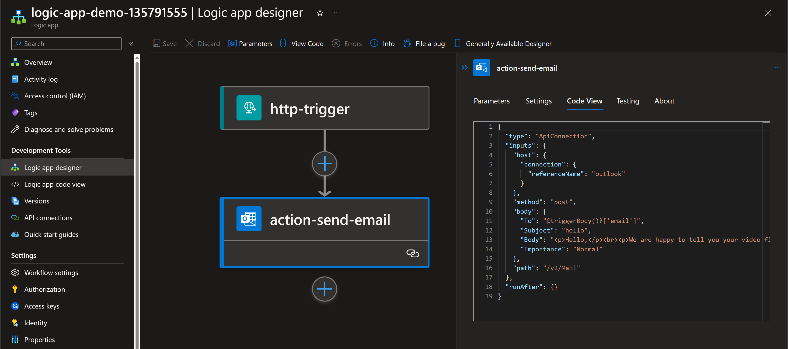
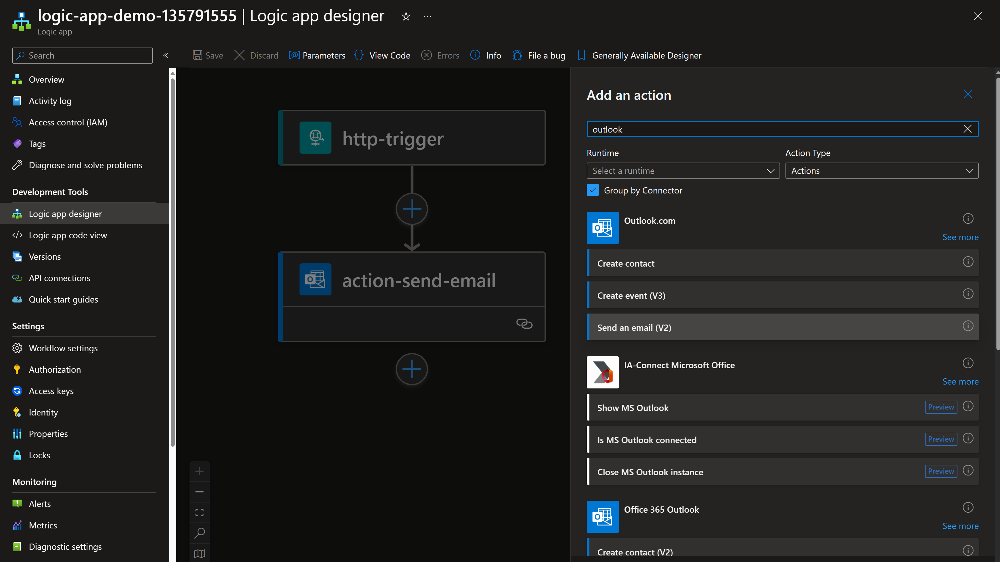
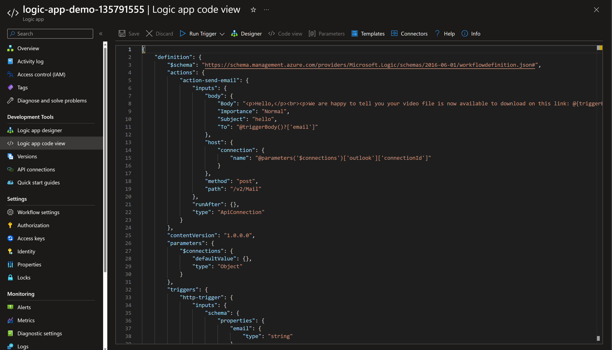
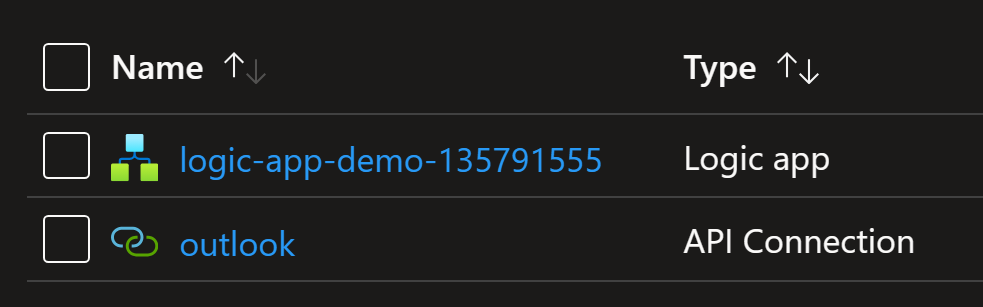
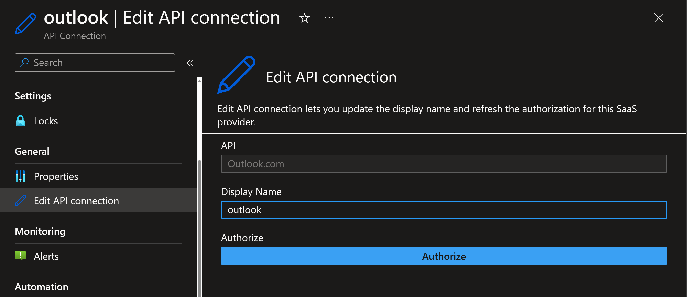
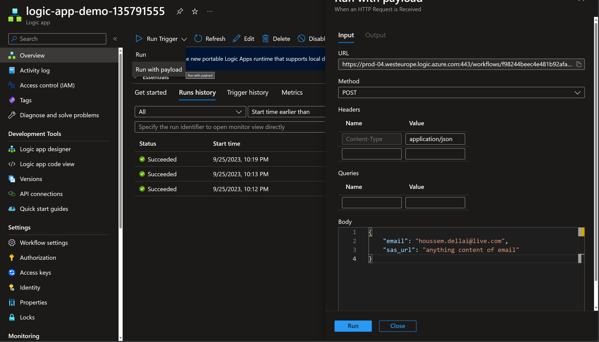

# Deploying Logic Apps using Terraform

## Introduction

In this lab, you will learn how to create and deploy an Azure Logic App using Terraform.

Logic Apps are invented to make it easy for developers and also non-developers to create applications called workflows.
It uses a visual designer where you can drag and drop actions instead of writing code.

Behind the scenes, a JSON ARM template is generated to save the workflow configuration.



You can export that ARM template and use to redeploy the same Logic App workflow.

This approach is much more easier and faster than creating the Logic App using ARM templates without using the visual designer.
That is because the syntax of the Logic Apps takes a bit long time to understand it.

## Issue with Terraform provider's support for Logic Apps

The visual designer generates ARM template. What about Terraform ?

Terraform defines resources to create a workflow, triggers and actions.
But for the actions it relies on JSON ARM template. And it is a 'headache' to configure.
You will find it much more practical to just use the exported ARM template and deploy it as it is using `azurerm_resource_group_template_deployment`.

## Creating Logic App using Azure portal

In order to understand how Logic App works, you will need to create the Logic App workflow manually using the visual designer.
You want to to use Logic App to send an email when you trigger it.

Start be creating a new Logic App resource in Azure portal. Then go to `Logic app designer` section to start the creation.



The workflow will be composed of two components:
- A trigger of type HTTP trigger that accepts a JSON payload containing the email destination and content
- An Action to compose and send email using `outlook` connector, to the destination email from the trigger

The `outlook` action will use your own outlook user identity to send emails on your behalf.

The end result should be like this.


## Deploying Logic App using Terraform and ARM template

Now that the Logic App ARM template is generated, you can go to export it.



You will use that ARM template to deploy it using Terraform with `azurerm_resource_group_template_deployment`.

```hcl

resource "azurerm_resource_group_template_deployment" "logic_app" {
  name                = "logic-app-deploy"
  resource_group_name = azurerm_resource_group.rg.name
  deployment_mode     = "Incremental" # "Complete" # 

  parameters_content = jsonencode({
    workflows_logic_app_name       = { value = "logic-app-demo-135791555" }
    connections_outlook_externalid = { value = azurerm_api_connection.api_connection_outlook.id }
    connections_outlook_id         = { value = data.azurerm_managed_api.managed_api_outlook.id }
  })

  template_content = <<TEMPLATE
{
    "$schema": "https://schema.management.azure.com/schemas/2019-04-01/deploymentTemplate.json#",
    "contentVersion": "1.0.0.0",
    "parameters": {
        "workflows_logic_app_name": {
            "type": "String"
        },
        "connections_outlook_externalid": {
            "type": "String"
        },
        "connections_outlook_id": {
            "type": "String"
        }
    },
    "variables": {},
    "resources": [
        {
            "type": "Microsoft.Logic/workflows",
            "apiVersion": "2017-07-01",
            "name": "[parameters('workflows_logic_app_name')]",
            "location": "westeurope",
            "properties": {
                "state": "Enabled",
                "definition": {
                    "$schema": "https://schema.management.azure.com/providers/Microsoft.Logic/schemas/2016-06-01/workflowdefinition.json#",
                    "contentVersion": "1.0.0.0",
                    "parameters": {
                        "$connections": {
                            "defaultValue": {},
                            "type": "Object"
                        }
                    },
                    "triggers": {
                        "http-trigger": {
                            "type": "Request",
                            "kind": "Http",
                            "inputs": {
                                "schema": {
                                    "properties": {
                                        "email": {
                                            "type": "string"
                                        },
                                        "sas_url": {
                                            "type": "string"
                                        }
                                    },
                                    "type": "object"
                                }
                            }
                        }
                    },
                    "actions": {
                        "action-send-email": {
                            "runAfter": {},
                            "type": "ApiConnection",
                            "inputs": {
                                "body": {
                                    "Body": "<p>Hello,</p><br><p>We are happy to tell you your video file is now available to download on this link: @{triggerBody()?['sas_url']}</p><br><p>Thank you,</p>",
                                    "Importance": "Normal",
                                    "Subject": "hello",
                                    "To": "@triggerBody()?['email']"
                                },
                                "host": {
                                    "connection": {
                                        "name": "@parameters('$connections')['outlook']['connectionId']"
                                    }
                                },
                                "method": "post",
                                "path": "/v2/Mail"
                            }
                        }
                    }
                },
                "parameters": {
                    "$connections": {
                        "value": {
                            "outlook": {
                                "connectionId": "[parameters('connections_outlook_externalid')]",
                                "connectionName": "outlook",
                                "id": "[parameters('connections_outlook_id')]"
                            }
                        }
                    }
                }
            }
        }
    ]
}
TEMPLATE
}
```

You can create the `outlook` API connection using Terraform, like the following.

```hcl
data "azurerm_managed_api" "managed_api_outlook" {
  name     = "outlook"
  location = azurerm_resource_group.rg.location
}

resource "azurerm_api_connection" "api_connection_outlook" {
  name                = "outlook"
  resource_group_name = azurerm_resource_group.rg.name
  managed_api_id      = data.azurerm_managed_api.managed_api_outlook.id
  display_name        = "outlook"
}
```

Now you are ready to deploy Logic App using Terraform.

```bash
terraform init
terraform plan -out tfplan
terraform apply tfplan
```

Check the deployed resources.



Make sure to authenticate to the outlook API connection.



## Test the workflow

Go to Overview -> Run Trigger -> Run with payload.
Then enter a JSON content with your email address.



Within a second, you should get a success message. Then you can check your email to find out you received an email from the Logic App workflow.

## Conclusion

You learned in this lab how to export an ARM template for Logic App and use in Terraform.