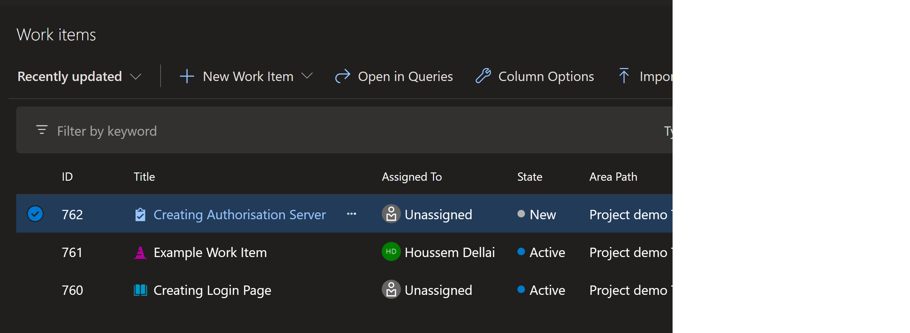
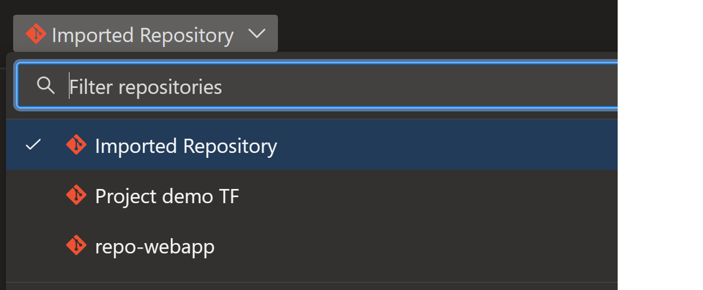
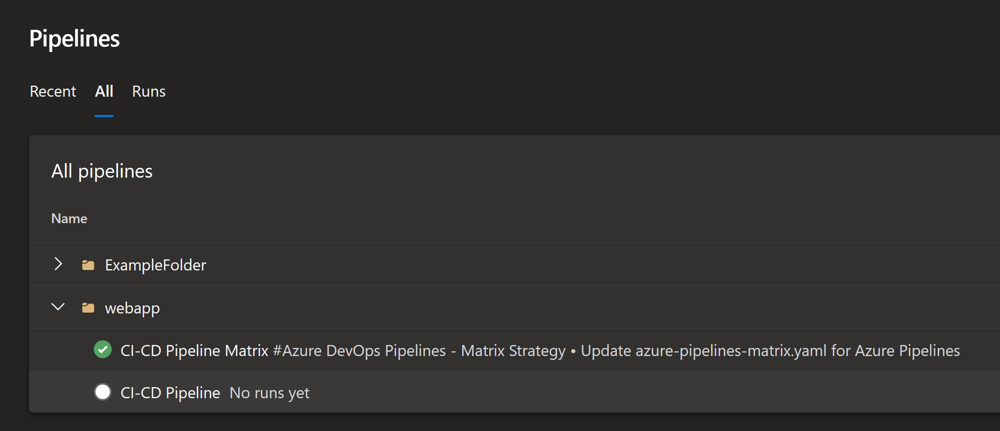
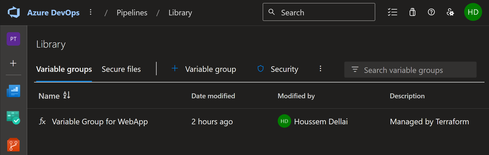

# Deploying Azure DevOps project using Terraform

## Introduction  
This document explains the [Terraform](https://www.terraform.io/) template used to define and provide the necessary data for an [Azure DevOps](https://azure.microsoft.com/en-us/services/devops/) project. Terraform is an Infrastructure as Code (IaC) tool that allows you to build, change, and version infrastructure safely and efficiently. This template includes definitions for various resources, such as the project itself, Git repositories, variable groups, build definitions (pipelines), and work items.  
  
## Explanation  
The template begins by defining an `azuredevops_project` resource named "Project demo TF". This is a private project that uses Git as its version control system and follows the Agile work item template.  
  
Next, the `azuredevops_git_repository` is defined. This is the Git repository for the project, named "repo-webapp". It is initialized as a clean repository, meaning it will not have any commits or branches initially.  
  
The `azuredevops_variable_group` is defined next. This is a group of variables that can be used throughout the project. The variable group includes a single variable, FOO, with the value of BAR.  
  
An `azuredevops_build_definition` resource, named "CI-CD Pipeline", is defined next. This is a Continuous Integration/Continuous Deployment (CI/CD) pipeline for the project. It includes a schedule for when the pipeline should run, which repositories it should include, and which variable groups it should use.  
  
Work items are defined next. These are tasks that need to be completed for the project. In this template, three types of work items are created: an issue, a user story, and a task.  
  
Finally, the template ends with the definition of another `azuredevops_git_repository` and `azuredevops_build_definition`. These are used to import an existing Git repository into the project and to define a pipeline for this imported repository.  

## Deploying the terraform template

Create PAT token in Azure DevOps.
Replace it in `providers.tf` file.

```bash
terraform init

terraform plan -out tfplan

terraform apply tfplan

terraform destroy
```

## Deployed resources

Items created by Terraform provider.


Repositories created or imported by Terraform.


Pipelines created or imported by Terraform.


Variable groups created by Terraform.


## Conclusion  
In conclusion, this Terraform template automates the creation and configuration of an Azure DevOps project and its related resources. By using this template, you can ensure that your infrastructure is consistent and repeatable, reducing the potential for human error and making it easier to manage and maintain your project. For more information about Terraform, visit the [official Terraform documentation](https://www.terraform.io/docs/index.html). For more information about Azure DevOps, visit the [official Azure DevOps documentation](https://docs.microsoft.com/en-us/azure/devops/?view=azure-devops).  