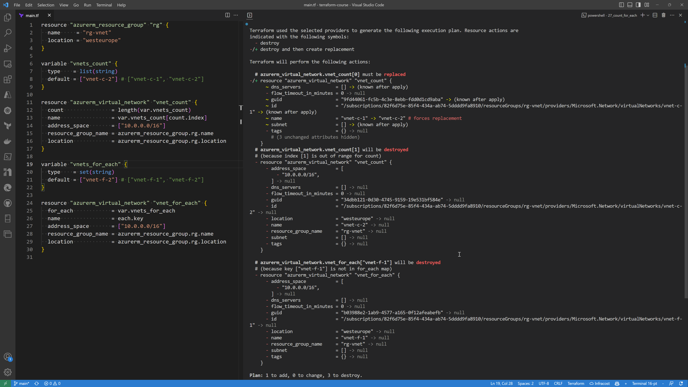

## Terraform count vs for_each





Make sure terraform CLI is installed
```bash
terraform
```

Initialize terraform Azure modules
```bash
terraform init
```

Plan and save the infra changes into tfplan file

```bash
terraform plan -out tfplan

# Terraform used the selected providers to generate the following execution plan. Resource actions are indicated with
# the following symbols:
#   + create

# Terraform will perform the following actions:

#   # azurerm_resource_group.rg will be created
#   + resource "azurerm_resource_group" "rg" {
#       + id       = (known after apply)
#       + location = "westeurope"
#       + name     = "rg-vnet"
#     }

#   # azurerm_virtual_network.vnet_count[0] will be created
#   + resource "azurerm_virtual_network" "vnet_count" {
#       + address_space       = [
#           + "10.0.0.0/16",
#         ]
#       + dns_servers         = (known after apply)
#       + guid                = (known after apply)
#       + id                  = (known after apply)
#       + location            = "westeurope"
#       + name                = "vnet-c-1"
#       + resource_group_name = "rg-vnet"
#       + subnet              = (known after apply)
#     }

#   # azurerm_virtual_network.vnet_count[1] will be created
#   + resource "azurerm_virtual_network" "vnet_count" {
#       + address_space       = [
#           + "10.0.0.0/16",
#         ]
#       + dns_servers         = (known after apply)
#       + guid                = (known after apply)
#       + id                  = (known after apply)
#       + location            = "westeurope"
#       + name                = "vnet-c-2"
#       + resource_group_name = "rg-vnet"
#       + subnet              = (known after apply)
#     }

#   # azurerm_virtual_network.vnet_for_each["vnet-f-1"] will be created
#   + resource "azurerm_virtual_network" "vnet_for_each" {
#       + address_space       = [
#           + "10.0.0.0/16",
#         ]
#       + dns_servers         = (known after apply)
#       + guid                = (known after apply)
#       + id                  = (known after apply)
#       + location            = "westeurope"
#       + name                = "vnet-f-1"
#       + resource_group_name = "rg-vnet"
#       + subnet              = (known after apply)
#     }

#   # azurerm_virtual_network.vnet_for_each["vnet-f-2"] will be created
#   + resource "azurerm_virtual_network" "vnet_for_each" {
#       + address_space       = [
#           + "10.0.0.0/16",
#         ]
#       + dns_servers         = (known after apply)
#       + guid                = (known after apply)
#       + id                  = (known after apply)
#       + location            = "westeurope"
#       + name                = "vnet-f-2"
#       + resource_group_name = "rg-vnet"
#       + subnet              = (known after apply)
#     }

# Plan: 5 to add, 0 to change, 0 to destroy.
```

Apply the infra changes

```bash
terraform apply tfplan
```

Now remove the vnet-c-1 and vnet-f-1 from main.tf file: ["vnet-f-2"] # ["vnet-f-1", "vnet-f-2"]

Plan and save the infra changes into tfplan file

```bash
terraform plan -out tfplan

# Terraform used the selected providers to generate the following execution plan. Resource actions are indicated with the
# following symbols:
#   - destroy
# -/+ destroy and then create replacement

# Terraform will perform the following actions:

#   # azurerm_virtual_network.vnet_count[0] must be replaced
# -/+ resource "azurerm_virtual_network" "vnet_count" {
#       ~ dns_servers             = [] -> (known after apply)
#       - flow_timeout_in_minutes = 0 -> null
#       ~ guid                    = "9fd44061-fc5b-4c3e-8ebb-fdd0d1cd9aba" -> (known after apply)
#       ~ id                      = "/subscriptions/82f6d75e-85f4-434a-ab74-5dddd9fa8910/resourceGroups/rg-vnet/providers/Microsoft.Network/virtualNetworks/vnet-c-1" -> (known after apply)
#       ~ name                    = "vnet-c-1" -> "vnet-c-2" # forces replacement
#       ~ subnet                  = [] -> (known after apply)
#       - tags                    = {} -> null
#         # (3 unchanged attributes hidden)
#     }

#   # azurerm_virtual_network.vnet_count[1] will be destroyed
#   # (because index [1] is out of range for count)
#   - resource "azurerm_virtual_network" "vnet_count" {
#       - address_space           = [
#           - "10.0.0.0/16",
#         ] -> null
#       - dns_servers             = [] -> null
#       - flow_timeout_in_minutes = 0 -> null
#       - guid                    = "34dbb121-0d30-4745-9159-19e531bf584e" -> null
#       - id                      = "/subscriptions/82f6d75e-85f4-434a-ab74-5dddd9fa8910/resourceGroups/rg-vnet/providers/Microsoft.Network/virtualNetworks/vnet-c-2" -> null
#       - location                = "westeurope" -> null
#       - name                    = "vnet-c-2" -> null
#       - resource_group_name     = "rg-vnet" -> null
#       - subnet                  = [] -> null
#       - tags                    = {} -> null
#     }

#   # azurerm_virtual_network.vnet_for_each["vnet-f-1"] will be destroyed
#   # (because key ["vnet-f-1"] is not in for_each map)
#   - resource "azurerm_virtual_network" "vnet_for_each" {
#       - address_space           = [
#           - "10.0.0.0/16",
#         ] -> null
#       - dns_servers             = [] -> null
#       - flow_timeout_in_minutes = 0 -> null
#       - guid                    = "b03988e2-1ab9-4577-a165-0f12afeabefb" -> null
#       - id                      = "/subscriptions/82f6d75e-85f4-434a-ab74-5dddd9fa8910/resourceGroups/rg-vnet/providers/Microsoft.Network/virtualNetworks/vnet-f-1" -> null
#       - location                = "westeurope" -> null
#       - name                    = "vnet-f-1" -> null
#       - resource_group_name     = "rg-vnet" -> null
#       - subnet                  = [] -> null
#       - tags                    = {} -> null
#     }

# Plan: 1 to add, 0 to change, 3 to destroy.
```

Now note the changes that will be made:
vnet-c-1 and vnet-f-1 will be destroyed, that ius expected
however, vnet-c-2 will be also deleted and recreated, that is not expected !
The learning here is that count will try to always start with zero index and will not try to preserve the existing resources.

Delete the infra
```bash
terraform destroy
```

More resources:
Terraform count doc:  
https://developer.hashicorp.com/terraform/language/meta-arguments/count  
Terraform for_each doc:  
https://developer.hashicorp.com/terraform/language/meta-arguments/for_each
